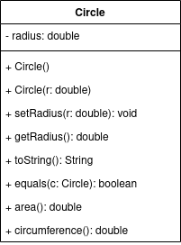

# Midterm Exam

You will have 100 minutes to complete this exam. You are not allowed to use any outside notes or resources; all work must be your own. Any code found not to be your own work will not be graded. Make sure to read _all_ the instructions for each question carefully and answer each question completely. Once you have finished, please commit and push your work to your repository. Please also confirm that the code is in your remote repository, i.e. that it is on bitbucket.org.

## Question One: Selection

Write a Java program that will prompt the user for an integer. If the integer is divisible by 3 print out "foo", and if the integer is divisible by 5 print out "bar". If the integer is divisible by both, your program should print out "foobar" and if the integer is not divisible by either, then your program should not print out anything.

**NOTE**: You may assume that the user will only ever enter an integer.

## Question Two: Repetition

Write a Java program that will prompt the user to enter positive numbers repeatedly until -1 has been entered, and then prints out the average of the numbers entered (not including the `-1`).

**NOTE**: You can assume that the user will only enter positive numbers and `-1`.

## Question Three: Arrays

Write a Java program that will prompt the user for exactly 5 words, which are stored in an array, and returns the word that occurs last alphabetically.

**NOTE:** 

- Your program must use an array.
- Do not sort the array or use ArrayLists.
- You can assume that the user will always enter words (not numbers).

## Question Four: Objects

Write a Java class based on the following UML diagram. Include all standard methods, such as constructors, mutators, accessors, toString, and equals. Additionally, implement any other methods shown in the diagram.

**NOTES:**

- `radius` should only ever be positive (i.e. greater than 0).
- The circumference of a circle is `2 * pi * radius`.
- The area of a circle is `pi * radius * radius`.
- You may use the value 3.14 for pi.
