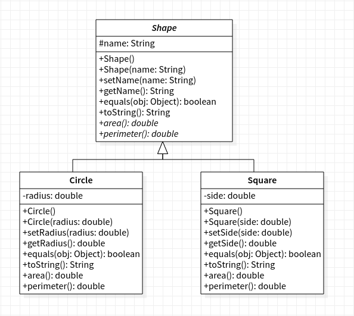

# Final Exam

You will have 100 minutes to complete this exam. You are not allowed to use any outside notes or resources; all work must be your own. Any code found not to be your own work will not be graded. Make sure to read _all_ the instructions for each question carefully and answer each question completely. Once you have finished, please commit and push your work to your repository. Please also confirm that the code is in your remote repository, i.e. that it is on bitbucket.org.

No late submissions will be accepted.

## Question One: Inheritance/Polymorphism/Abstract Classes

Write the Java classes based on the following UML diagram. Include all methods and class as shown in the diagram.

**NOTES:**

* `radius` and `side` can not be negative.
* In `Circle`, `area` should return `radius * radius * 3.14`.
* In `Circle`, `perimeter` should return `2 * radius * 3.14`.
* In `Square`, `area` should return `side * side`.
* In `Square`, `perimeter` should return `4 * side`.



## Question Two: ArrayLists

Write a Java program that prompts the user to enter a sequence of words (Strings), storing them in an ArrayList, and continues prompting the user for words until they enter `"Done"`. When they have finished entering words, your program should print out each letter of the alphabet along with a count of how many words started with that letter (you may skip printing out letters that have a count of 0).

For example, if the user enters `{"Apple", "Banana", "Berry", "Cherry"}`, your program should print out the following:

```java
A - 1
B - 2
C - 1
```

## Question Three: Sorting

Write a Java program that implements Bubble Sort for an Array (or ArrayList) of Strings (use the values below), sorting them in alphabetical order and prints out the sorted results.

```java
{"briefly", "mugwump", "articulation", "sync", "skein", "moire", "advisability", "varmint", "mandibular", "evergreen"}
```

## Question Four: Searching

Write a Java program that implements Binary Search for an Array (or ArrayList) of numbers (use the values below) and allows the user to search for a value, printing the position that the value is found at. If the value is not present, it should print -1.

```java
{8, 13, 18, 24, 31, 64, 65, 71, 73, 87}
```
